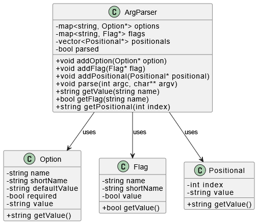

# парсер на C++

Эта программа реализует простую, но гибкую библиотеку для парсинга аргументов командной строки на языке C++ с использованием объектно-ориентированного подхода. Она позволяет удобно работать с опциями, флагами и позиционными аргументами.

## Возможности

- Поддержка именованных опций с обязательным или необязательным значением.
- Поддержка позиционных аргументов в нужном порядке.
- Обработка аргументов `argc` / `argv` в одном вызове.
- Доступ к значению любого аргумента по имени или индексу.
- Гибкое добавление новых типов аргументов при необходимости.
- Разделение логики по отдельным классам — легко расширять и тестировать.

## Структура классов

На диаграмме ниже показаны основные классы, их поля и связи между ними:




```bash
g++ -std=c++17 bin/main.cpp lib/*.cpp -o argparser
./argparser --input data.txt run
```
